# AWS-Multi-Region-Resilient-Platform

# Mission Objective

* A production-shaped, three-region-aware application stack built entirely in Terraform: a load balancer with a real TLS certificate and a real domain name, a Web Application Firewall, a CDN layer, a second AWS region connected by a private network link, and an automated system that writes up an incident report the moment something goes wrong — rather than just sending a bare notification.
* This is the largest project in the series, and it's split across **three separate Terraform projects**, not one. Treating them like a single project is the single most common way to get stuck, so that structure is covered on its own below.
* **Primary region:** Tokyo (`ap-northeast-1`). **Secondary region:** São Paulo (`sa-east-1`). **One piece (the CDN's WAF) has to live in `us-east-1`** specifically, because CloudFront-attached resources of that type only exist in that one region, regardless of where everything else is built.

# Checkpoints

1. [Prerequisites](#prerequisites)
2. [Why This Is Three Separate Terraform Projects](#why-this-is-three-separate-terraform-projects)
3. [Step-1 (Data Sources & Account Facts)](#step-1-data-sources--account-facts)
4. [Step-2 (Primary Region Network)](#step-2-primary-region-network)
5. [Step-3 (Private VPC Endpoints)](#step-3-private-vpc-endpoints)
6. [Step-4 (Layered Security Groups)](#step-4-layered-security-groups)
7. [Step-5 (TLS Certificate)](#step-5-tls-certificate)
8. [Step-6 (Load Balancer, Target Group, Listener)](#step-6-load-balancer-target-group-listener)
9. [Step-7 (Web Application Firewall)](#step-7-web-application-firewall)
10. [Step-8 (Private Database & Credentials)](#step-8-private-database--credentials)
11. [Step-9 (Application Server & IAM)](#step-9-application-server--iam)
12. [Step-10 (Monitoring: Logs, Alarms, Dashboard)](#step-10-monitoring-logs-alarms-dashboard)
13. [Step-11 (Automated Incident Reporting)](#step-11-automated-incident-reporting)
14. [Step-12 (Storage for Logs & Reports)](#step-12-storage-for-logs--reports)
15. [Step-13 (Transit Gateway to São Paulo)](#step-13-transit-gateway-to-são-paulo)
16. [Deployment Order](#deployment-order)
17. [Errors](#errors)
18. [Deliverables](#deliverables)
19. [Final Step - Teardown](#final-step---teardown)
20. [Author](#author)

# Prerequisites

* Terraform installed (version 1.9 or higher)
* AWS CLI configured with credentials for the target account
* A registered domain name with a Route 53 hosted zone (or DNS you can add validation records to)
* Basic understanding of AWS networking, IAM, and Terraform state
* Patience & lots of coffee — this one takes a while to apply

# Why This Is Three Separate Terraform Projects

This is the single most important structural thing to understand before touching any of this:

* **The root project** (this directory) manages Tokyo — the network, database, load balancer, WAF, monitoring, and incident automation.
* **A second, completely separate project** (`liberdade/`) manages São Paulo — its own VPC, its own small application stack, and the *accepting* side of the Transit Gateway peering request from Step 13. It has its own separate remote state, entirely independent from the root project's.
* **A third, completely separate project** (`Cloudfront/`) manages the CloudFront CDN layer sitting in front of the Tokyo load balancer. It also has its own separate state, and rather than referencing the load balancer as a direct Terraform resource, it looks it up by name after the fact — as far as this project is concerned, the load balancer is just a fact about the world it discovers, not something it created itself.

Because of this structure:

* Each of the three has to be initialized and applied **separately, in its own directory** — there's no single command that builds all three at once.
* **Order matters and is one-directional**: root has to be applied first, since both other projects depend on something only root can create (the load balancer, for the CDN project; the peering request itself, for the São Paulo project).
* Tearing everything down happens in the **exact reverse order** — CDN and São Paulo first, then root last.

# Step-1 (Data Sources & Account Facts)

Rather than hardcoding values that could go stale, this project asks AWS (and one outside service) directly for a handful of facts it needs before building anything — your current public IP address (for restricting SSH later), which availability zones exist in the primary region, the AWS account ID you're deploying into, and the current region's own name.

# Step-2 (Primary Region Network)

The same core pattern as every other project in this series, scaled up: a VPC, public and private subnets, an Internet Gateway, a NAT Gateway, and matching route tables for the public and private sides.

See screenshot below

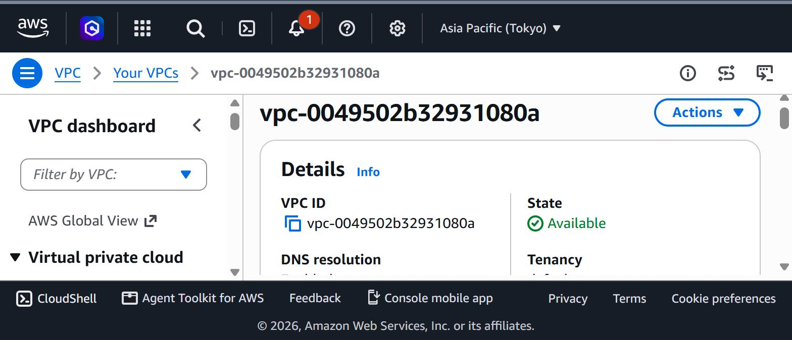

# Step-3 (Private VPC Endpoints)

Normally, even a server sitting in a private subnet still has to route out through the NAT Gateway to reach AWS's own services. VPC endpoints solve this by creating a direct, private connection from inside the VPC straight to a specific AWS service. This project sets one up for each of: Secrets Manager, Systems Manager (and its two related messaging services), CloudWatch Logs, and KMS. A dedicated security group controls access, allowing only encrypted HTTPS traffic to reach them.

# Step-4 (Layered Security Groups)

* **The load balancer's security group** — inbound HTTP and HTTPS from the internet. This is the only thing in the whole architecture directly exposed to the public internet.
* **The EC2 security group** — inbound traffic only from the load balancer's security group.
* **The database security group** — inbound MySQL traffic only from the EC2 security group.

Each layer only trusts the one specific layer in front of it, never a broader IP range and never "anywhere."

# Step-5 (TLS Certificate)

A certificate is requested from AWS Certificate Manager for both the base domain and the application's subdomain, using DNS-based validation. This project can either create the validation record itself or simply look up an already-existing hosted zone and add just the records it needs — the default and safer option.

# Step-6 (Load Balancer, Target Group, Listener)

An Application Load Balancer is created in the public subnets, along with a target group and an HTTPS listener using the certificate from Step-5.

See screenshot below

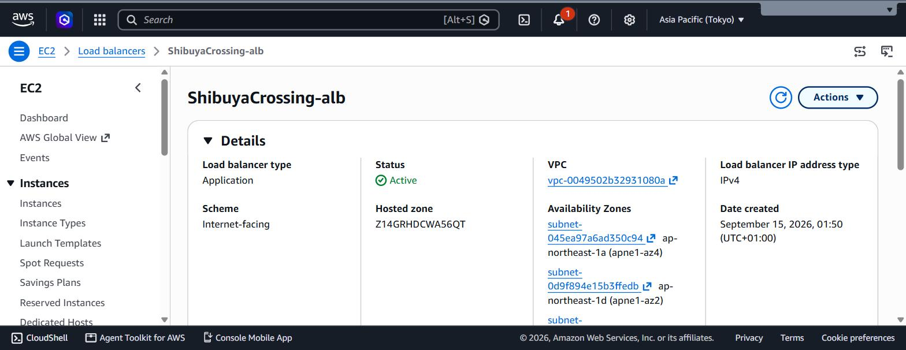

# Step-7 (Web Application Firewall)

A Web ACL is created and attached directly to the load balancer, giving it a layer of protection against common attack patterns before traffic ever reaches the application itself. Its activity logs can be sent to CloudWatch, S3, or a streaming delivery pipeline, chosen through a single setting.

See screenshot below

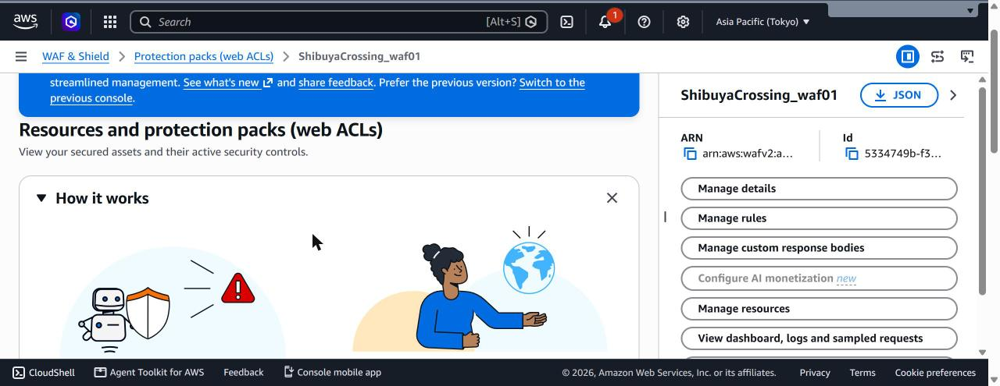

# Step-8 (Private Database & Credentials)

A private RDS MySQL instance is placed in the private subnets, with a Secrets Manager secret holding its full connection details as one JSON object, and plain (non-secret) values — endpoint, port, database name — published separately to Parameter Store.

See screenshots below

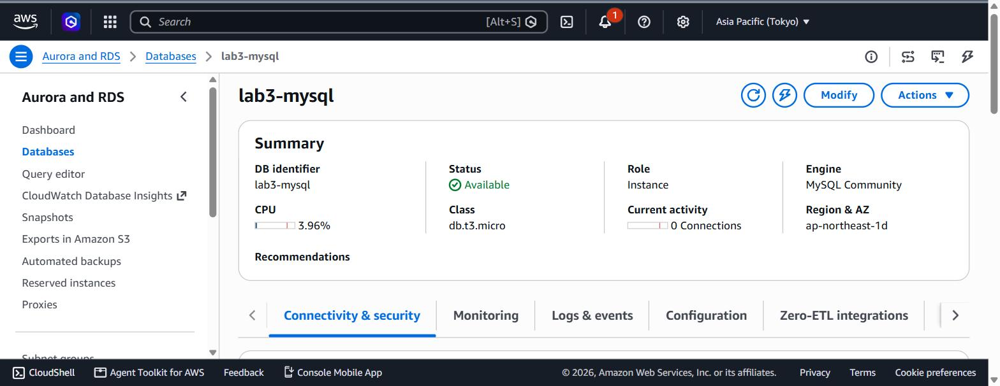

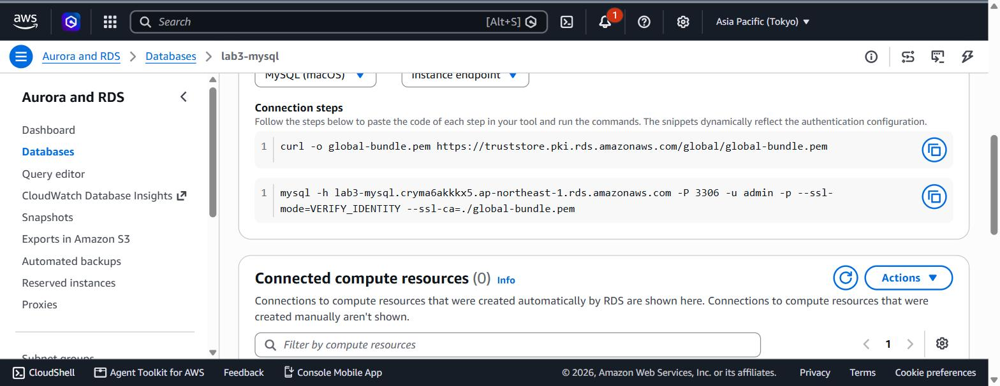

# Step-9 (Application Server & IAM)

The EC2 instance is launched using the latest Amazon Linux image, placed behind the load balancer, with an IAM role scoped to: reading the one specific database secret, reading the specific Parameter Store values, writing to one specific CloudWatch log group, and using Systems Manager Session Manager for shell access without an open port 22.

The startup script installs the application into a dedicated, restricted system user account and runs it as a background service that restarts automatically if it crashes.

# Step-10 (Monitoring: Logs, Alarms, Dashboard)

A log group receives the application's logs, a metric filter watches for database connection error patterns, and an alarm watches that metric. A second alarm watches the load balancer's own error rate directly. A dashboard pulls several of these signals together into one visual view.

See screenshot below

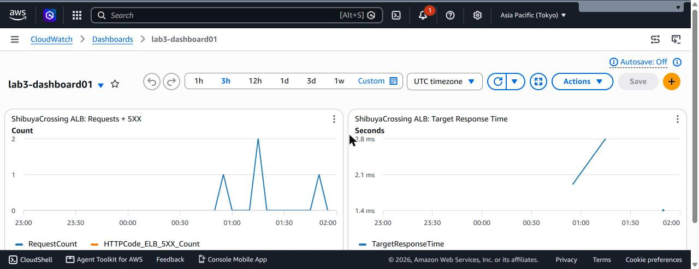

# Step-11 (Automated Incident Reporting)

Rather than an alarm only sending a plain notification, this project wires the alarm's SNS topic to two subscribers at once:

* **A real email address**, for a human to be notified directly.
* **A small Lambda function**, triggered whenever the alarm fires, that writes up an incident report. It has its own tightly scoped IAM role, and its code is protected using AWS's code-signing feature.
* **A written runbook document**, stored in Systems Manager, giving a human step-by-step instructions for the same incident-response process the Lambda function automates.

See screenshot below

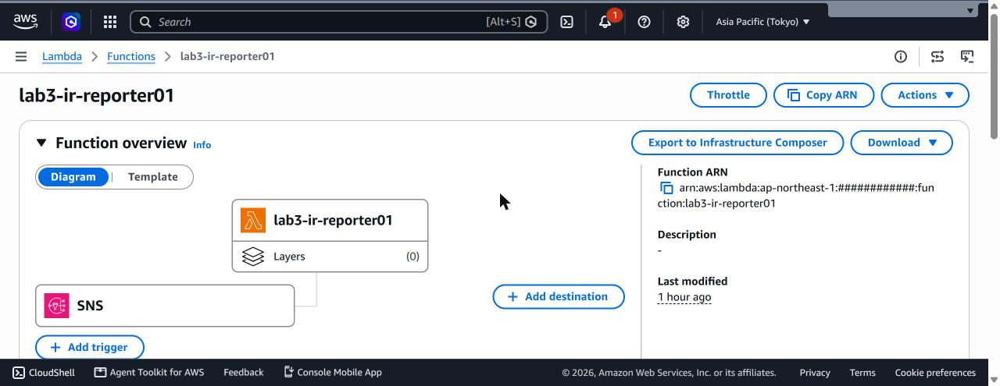

# Step-12 (Storage for Logs & Reports)

Three separate S3 buckets hold generated output rather than being part of the live application path: one for the load balancer's own access logs, one for the WAF's logs, and one for the incident reports the Lambda function produces. Each has encryption, versioning, and public access blocking configured.

See screenshot below

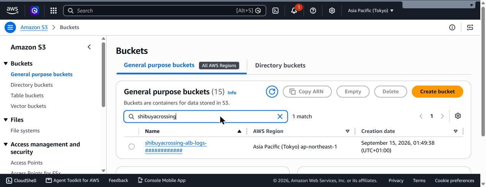

# Step-13 (Transit Gateway to São Paulo)

A Transit Gateway is created in the primary region specifically to allow private, non-internet-routed traffic between this VPC and a second VPC in São Paulo. A **peering attachment request** is created from this side — the São Paulo side has to separately accept it before traffic can actually flow.

See screenshot below

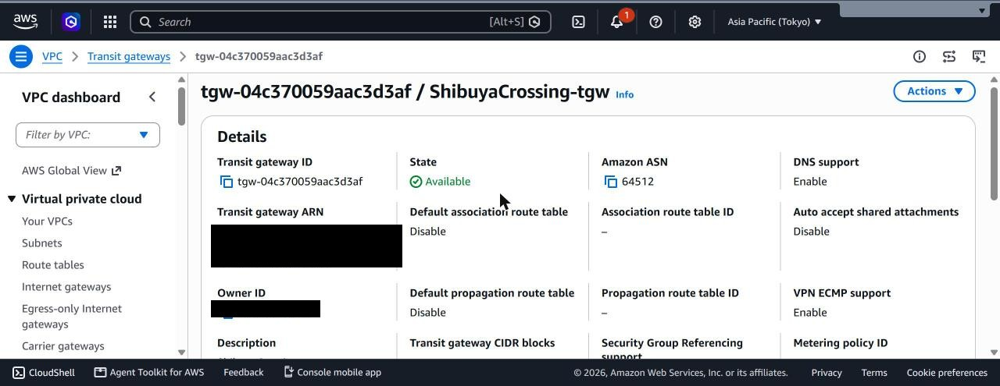

# Deployment Order

1. Validate all three projects' configuration syntax before touching AWS at all.
2. Deploy the root (Tokyo) project first, and expect it to take a while — most of the wait is the database and the certificate's validation process.
3. Confirm zero drift immediately afterward — re-running a plan should show nothing left to change.
4. Test the application through the load balancer directly (a plain connection to the raw ALB address will show a certificate mismatch warning until the real domain name is pointing at it — that's expected).
5. Set up a separate state storage location for the São Paulo project if one doesn't already exist, then deploy it, feeding it the peering attachment's ID from the root project's own output.
6. Deploy the CloudFront project last, only once root genuinely exists.
7. If any deployment gets interrupted partway through, check whether anything finished creating in AWS but never made it into Terraform's own bookkeeping before re-running.
8. Tear down in the exact reverse order of deployment.

See screenshots below

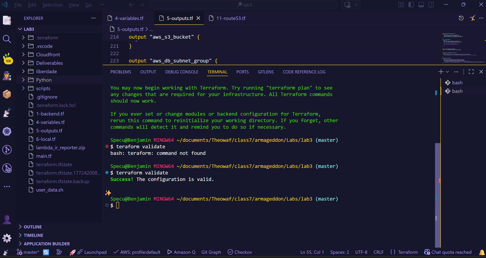

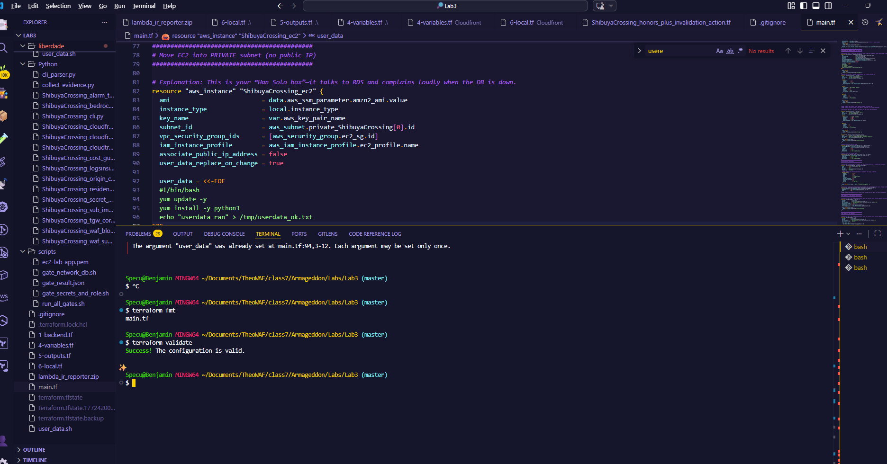

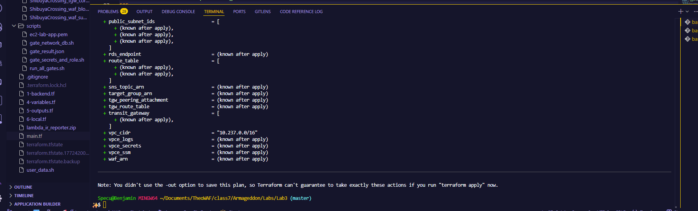

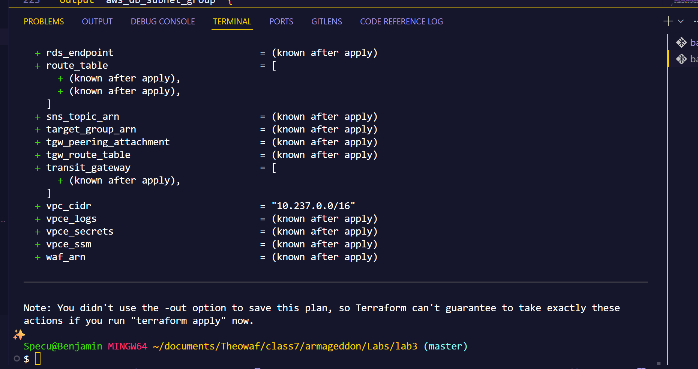

# Errors

* **A real secret-leak incident, already handled.** An EC2 SSH private key was accidentally committed into this repository's very first commit at some point in its history. It was handled properly end to end: checking whether the leaked key was still registered and usable in AWS before assuming the worst, removing it from version control going forward, rotating it for a fresh one, and checking *every* branch (not just the one currently being worked on) for the same leaked commit, since early history is often shared across branches.

# Deliverables

Congrats, you have successfully completed your mission and you are now ready for more pain. Collect screenshots for your records.

See screenshots below

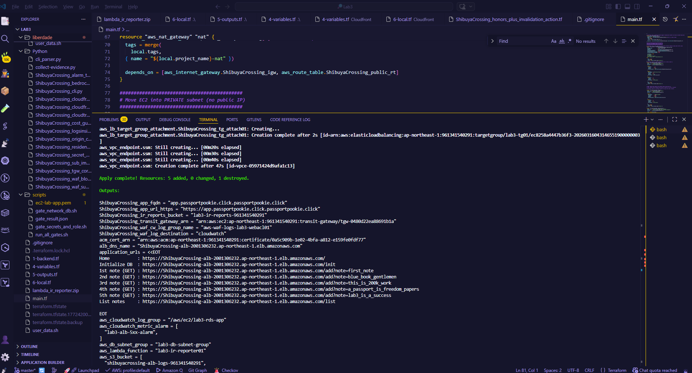

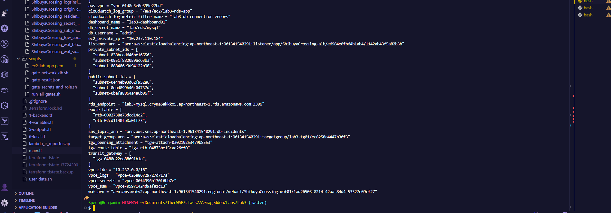

# **Final Step - Teardown**

Unless you can print your own money, you will need to tear down your deployment.

* Tear down in the **exact reverse order** of deployment: CloudFront project first, then São Paulo (`liberdade/`), then root last.
* Input `terraform destroy` in each project directory, in that order.
* You will be asked to confirm deletion — say yes.
* Double check your AWS console that deployments are terminated.
* Triple check everything — Jeff Bezos has enough money.

See screenshot below

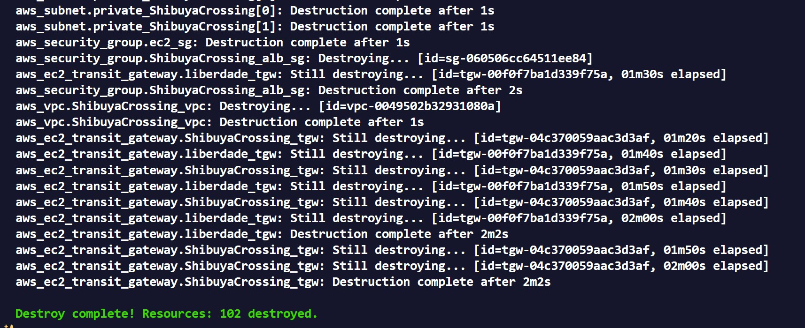

# Author

Benjamin Cooper
